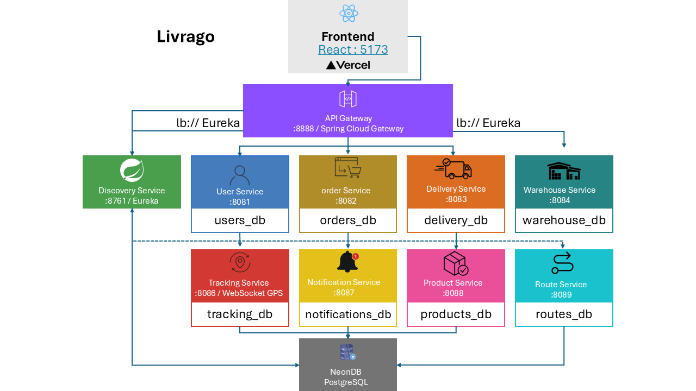
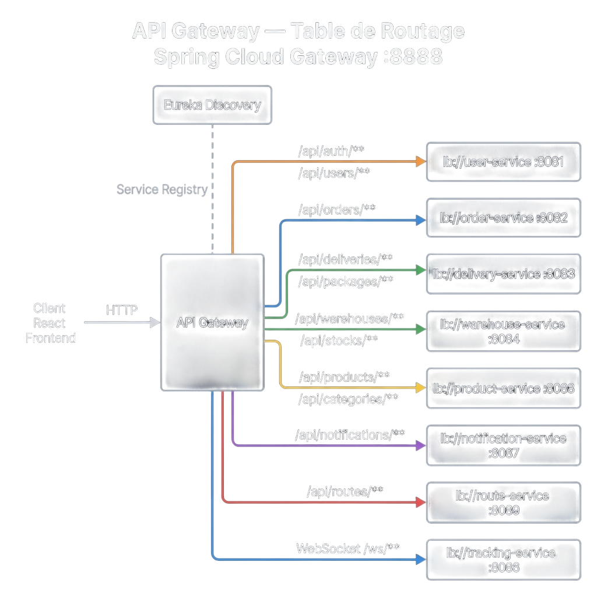
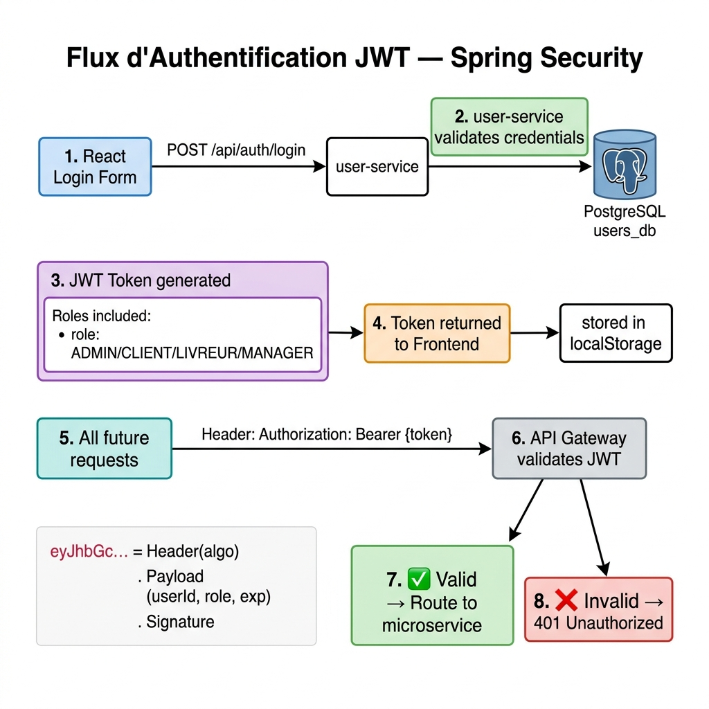
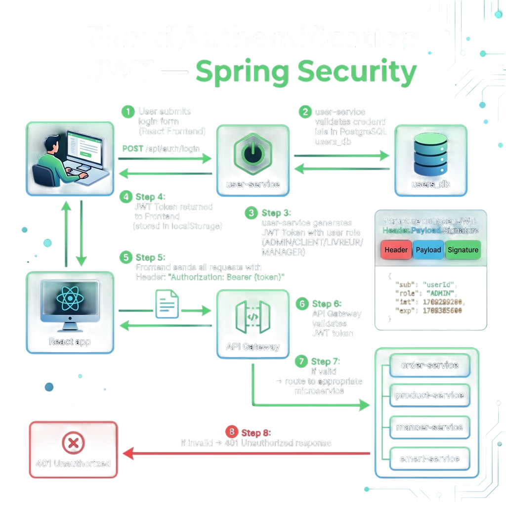
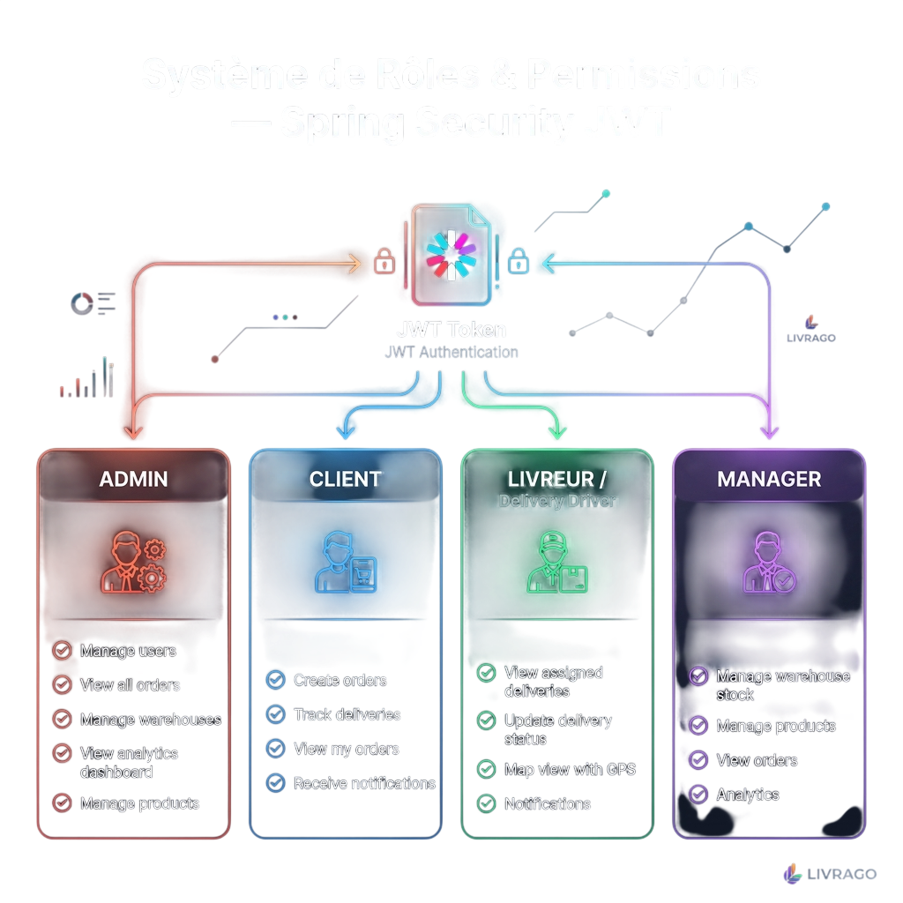
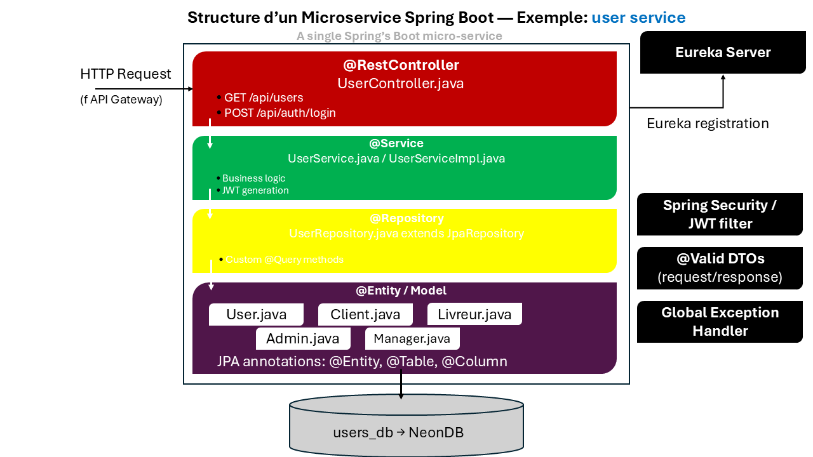
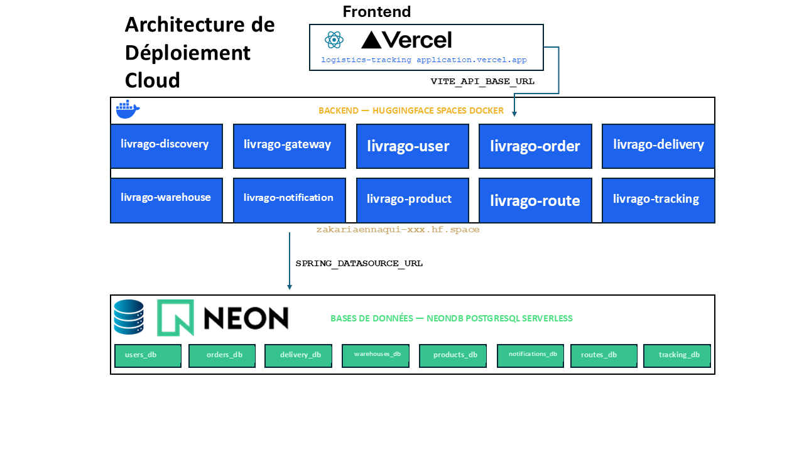
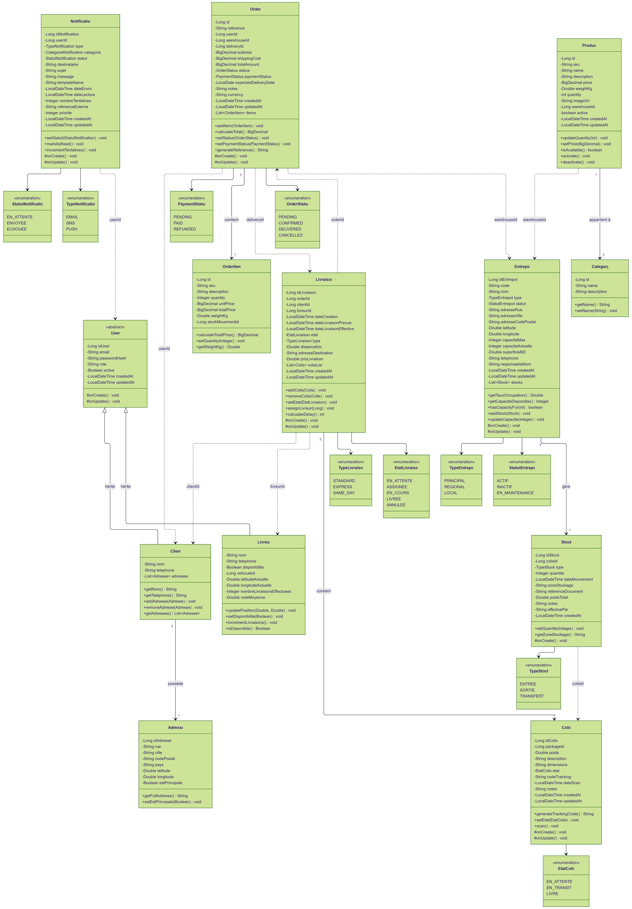
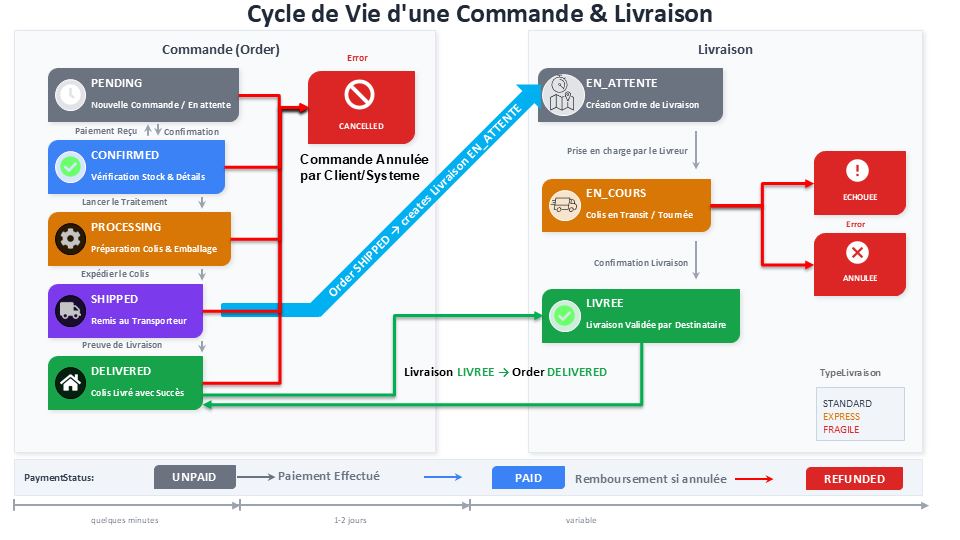
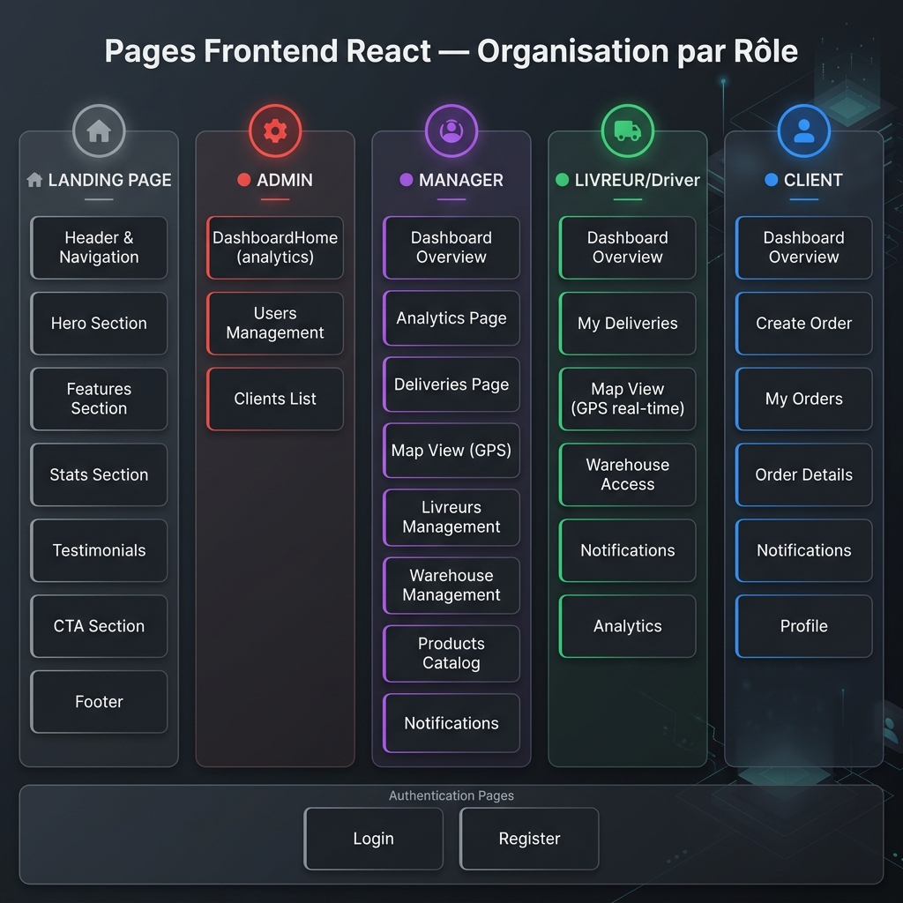

<div align="center">

<!-- Tech Badges -->


# Livrago — Application de Suivi Logistique

**Architecture Microservices Java EE · Spring Boot · Spring Cloud · React**

[](https://github.com/zakariaennaqui/Logistics-Tracking-Application)
[](https://logistics-tracking-application.vercel.app)

> Projet Java EE — ENSA Berrechid · S7 · 2025

</div>

---

## Table des Matières

- [Vue d'Ensemble](#vue-densemble)
- [Architecture Globale](#architecture-globale)
- [Comment Fonctionnent les Microservices](#comment-fonctionnent-les-microservices-spring-boot)
- [API Gateway & Routage](#api-gateway--routage)
- [Authentification JWT](#authentification-jwt--spring-security)
- [Les 9 Microservices](#les-9-microservices)
- [Rôles Utilisateurs](#rôles-utilisateurs)
- [Structure d'un Microservice](#structure-interne-dun-microservice)
- [Technologies](#technologies-utilisées)
- [Lancement Local](#lancement-en-local)
- [Déploiement Cloud](#déploiement-en-production)
- [API Reference](#api-reference)

---

## Vue d'Ensemble

**Livrago** est une plateforme logistique complète construite en **architecture microservices Java EE**. Elle permet à quatre types d'utilisateurs (Admin, Client, Livreur, Manager) de gérer l'intégralité du cycle logistique : commandes, entrepôts, livraisons, produits, itinéraires et suivi GPS en temps réel.

### Fonctionnalités principales
| Fonctionnalité | Description |
|---|---|
| Authentification JWT | Login/Register avec rôles Spring Security |
| Gestion des Commandes | CRUD complet, statuts, items |
| Suivi des Livraisons | Colis, livreurs assignés, statuts |
| Gestion d'Entrepôts | Stocks, inventaire, localisation |
| Tracking GPS Temps Réel | WebSocket STOMP, carte interactive |
| Calcul d'Itinéraires | Via OpenRouteService API |
| Notifications | Système de notifications utilisateurs |
| Catalogue Produits | Produits, catégories |
| Dashboard Analytics | Statistiques par rôle |

---

## Architecture Globale



L'application est découpée en **10 services indépendants** (9 microservices + 1 frontend), chacun avec sa propre base de données PostgreSQL sur NeonDB.

### Pourquoi les Microservices ?

```
✕ Approche Monolithique               ✓ Approche Microservices
────────────────────                   ────────────────────────
┌──────────────────┐                  ┌────┐ ┌────┐ ┌────┐
│ TOUT dans 1 app  │                  │ US │ │ OS │ │ DS │
│                  │                  └────┘ └────┘ └────┘
│ Users+Orders+    │                  ┌────┐ ┌────┐ ┌────┐
│ Deliveries+      │   →→→ →→→ →→→    │ WS │ │ TS │ │ NS │
│ Products+...     │                  └────┘ └────┘ └────┘
│                  │                  ┌────┐ ┌────┐
│ Si 1 bug → TOUT  │                  │ PS │ │ RS │
│ plante           │                  └────┘ └────┘
└──────────────────┘
  Déploiement = 1 WAR                 Déploiement indépendant
  Scaling impossible                  Scaling par service
  Équipe bloquée sur 1 projet         Équipes parallèles
```

---

## Comment Fonctionnent les Microservices Spring Boot

### 1. Service Discovery — Eureka Server

Eureka est l'**annuaire centralisé** de tous les microservices. Chaque service s'y enregistre au démarrage et y envoie un *heartbeat* toutes les 30 secondes.

```yaml
# application.properties de chaque microservice
spring.application.name=user-service
eureka.client.service-url.defaultZone=http://localhost:8761/eureka/
eureka.client.register-with-eureka=true
eureka.client.fetch-registry=true
```

**Résultat dans Eureka Dashboard** (`http://localhost:8761`) :
```
Instances registered with Eureka:
  USER-SERVICE         → 192.168.1.10:8081  ✓ UP
  ORDER-SERVICE        → 192.168.1.11:8082  ✓ UP
  DELIVERY-SERVICE     → 192.168.1.12:8083  ✓ UP
  WAREHOUSE-SERVICE    → 192.168.1.13:8084  ✓ UP
  TRACKING-SERVICE     → 192.168.1.14:8086  ✓ UP
  NOTIFICATION-SERVICE → 192.168.1.15:8087  ✓ UP
  PRODUCT-SERVICE      → 192.168.1.16:8088  ✓ UP
  ROUTE-SERVICE        → 192.168.1.17:8089  ✓ UP
  API-GATEWAY          → 192.168.1.18:8888  ✓ UP
```

---

## API Gateway & Routage



La Gateway est le **point d'entrée unique** — le frontend ne connaît qu'une seule URL.

### Table de routage complète

| Route Pattern | Service cible | Port local |
|---|---|---|
| `/api/auth/**` | `user-service` | 8081 |
| `/api/users/**` | `user-service` | 8081 |
| `/api/admin/**` | `user-service` | 8081 |
| `/api/orders/**` | `order-service` | 8082 |
| `/api/deliveries/**` | `delivery-service` | 8083 |
| `/api/packages/**` | `delivery-service` | 8083 |
| `/api/warehouses/**` | `warehouse-service` | 8084 |
| `/api/stocks/**` | `warehouse-service` | 8084 |
| `/api/products/**` | `product-service` | 8088 |
| `/api/categories/**` | `product-service` | 8088 |
| `/api/notifications/**` | `notification-service` | 8087 |
| `/api/routes/**` | `route-service` | 8089 |
| `WebSocket /ws/**` | `tracking-service` | 8086 |

```yaml
# application.yaml de l'API Gateway
spring:
  cloud:
    gateway:
      routes:
        - id: user-route
          uri: lb://user-service    # lb:// = LoadBalancer via Eureka
          predicates:
            - Path=/api/users/**
        - id: order-route
          uri: lb://order-service
          predicates:
            - Path=/api/orders/**
        # ... etc
```

---

## Authentification JWT & Spring Security

<!-- 
 -->

### Flux complet
1. Client envoie `POST /api/auth/login` avec `{email, password}`
2. `user-service` vérifie les credentials dans `users_db`
3. Génère un **JWT Token** avec le rôle de l'utilisateur
4. Token stocké dans `localStorage` côté frontend
5. Chaque requête suivante inclut : `Authorization: Bearer {token}`
6. Le filtre JWT de la Gateway valide le token à chaque requête

### Structure du JWT Token
```json
{
  "header": { "alg": "HS256", "typ": "JWT" },
  "payload": {
    "sub": "user@email.com",
    "role": "ROLE_CLIENT",
    "userId": 42,
    "iat": 1720000000,
    "exp": 1720086400
  },
  "signature": "..."
}
```

---

## Les 9 Microservices

| # | Service | Port | Rôle | Base de données |
|---|---|---|---|---|
| 1 | `discovery-service` | **8761** | Eureka — annuaire de tous les services | — |
| 2 | `api-gateway` | **8888** | Routage + sécurité JWT | — |
| 3 | `user-service` | **8081** | Auth, JWT, rôles (Admin/Client/Livreur/Manager) | `users_db` |
| 4 | `order-service` | **8082** | Commandes, items, statuts | `orders_db` |
| 5 | `delivery-service` | **8083** | Livraisons, colis, assignation livreur | `delivery_db` |
| 6 | `warehouse-service` | **8084** | Entrepôts, stocks, inventaire | `warehouses_db` |
| 7 | `tracking-service` | **8086** | GPS temps réel via WebSocket STOMP | `tracking_db` |
| 8 | `notification-service` | **8087** | Notifications utilisateurs | `notifications_db` |
| 9 | `product-service` | **8088** | Catalogue produits & catégories | `products_db` |
| 10 | `route-service` | **8089** | Calcul d'itinéraires OpenRouteService | `routes_db` |

---

## Rôles Utilisateurs

<!--  -->

L'application gère **4 rôles** avec des permissions différentes via Spring Security :

### 🔴 ADMIN
- Gestion complète des utilisateurs
- Dashboard analytics global
- Gestion des entrepôts et produits
- Vue sur toutes les commandes

### 🔵 CLIENT
- Créer et suivre ses commandes
- Voir l'historique de ses livraisons
- Recevoir des notifications
- Accéder au tracking GPS de sa commande

### 🟢 LIVREUR
- Voir ses livraisons assignées
- Mettre à jour les statuts de livraison
- Vue carte avec GPS temps réel
- Notifications push sur ses missions

### 🟣 MANAGER
- Gérer les stocks d'entrepôt
- Gérer le catalogue produits
- Voir les commandes et livraisons
- Analytics de son entrepôt

---

## Structure Interne d'un Microservice



Chaque service suit l'architecture en couches **MVC + Repository Pattern** :

```
user-service/
├── UserServiceApplication.java         @SpringBootApplication
├── config/
│   ├── SecurityConfig.java             Spring Security + JWT filter
│   └── CorsConfig.java                 CORS pour le frontend
├── controller/
│   ├── AuthController.java             POST /api/auth/login, /register
│   └── UserController.java             GET/POST/PUT /api/users/**
├── service/
│   ├── UserService.java                Interface
│   └── UserServiceImpl.java            @Service — logique métier
├── repository/
│   └── UserRepository.java             @Repository extends JpaRepository
├── model/
│   ├── User.java                       @Entity @Table("users")
│   ├── Client.java                     @Entity — hérite de User
│   ├── Livreur.java                    @Entity — hérite de User
│   ├── Admin.java                      @Entity — hérite de User
│   └── Manager.java                    @Entity — hérite de User
├── dtos/
│   ├── request/LoginRequest.java       @Valid DTO
│   └── response/UserResponse.java      DTO sortant
├── security/
│   └── JwtFilter.java                  OncePerRequestFilter
└── exceptions/
    └── GlobalExceptionHandler.java     @ControllerAdvice
```

### Exemple d'un Controller Spring Boot
```java
@RestController
@RequestMapping("/api/auth")
public class AuthController {

    @Autowired
    private UserService userService;

    @PostMapping("/login")
    public ResponseEntity<AuthResponse> login(@Valid @RequestBody LoginRequest req) {
        String token = userService.authenticate(req.getEmail(), req.getPassword());
        return ResponseEntity.ok(new AuthResponse(token));
    }
}
```

### Exemple d'une Entity JPA
```java
@Entity
@Table(name = "users")
@Inheritance(strategy = InheritanceType.JOINED)
public class User {
    @Id @GeneratedValue(strategy = GenerationType.IDENTITY)
    private Long id;

    @Column(unique = true, nullable = false)
    private String email;

    private String password;  // BCrypt hashé

    @Enumerated(EnumType.STRING)
    private Role role;  // ADMIN, CLIENT, LIVREUR, MANAGER
}
```

---

## Tracking GPS Temps Réel — WebSocket STOMP

```
Livreur (app mobile / web)
        │
        ▼  POST /api/gps/position {lat, lng, deliveryId}
tracking-service
        │  SimpMessagingTemplate
        │  .convertAndSend("/topic/tracking/{deliveryId}", position)
        ▼
Client React (abonné au topic)
        │  stompClient.subscribe("/topic/tracking/42", callback)
        ▼
Carte leaflet/maps → mise à jour en temps réel
```

---

## Technologies Utilisées

### Backend
| Technologie | Version | Usage |
|---|---|---|
| Java | 17 | Langage principal |
| Spring Boot | 3.5.7 | Framework microservices |
| Spring Cloud Gateway | 2024 | API Gateway et routage |
| Spring Eureka | 2024 | Service Discovery |
| Spring Security | 6.x | Authentification et autorisation |
| JWT (jjwt) | 0.12 | Tokens d'authentification |
| Spring WebSocket + STOMP | 3.5 | GPS temps réel |
| Spring Data JPA | 3.5 | ORM |
| Hibernate | 6.x | Implémentation JPA |
| PostgreSQL Driver | 42.x | Connexion base de données |
| Maven | 3.9 | Build et gestion des dépendances |

### Frontend
| Technologie | Version | Usage |
|---|---|---|
| React | 18 | Interface utilisateur |
| TypeScript | 5.x | Typage statique |
| TailwindCSS | 3.x | Styles |
| Axios | 1.x | Appels API REST |
| SockJS + STOMP | — | WebSocket client |
| React Router | 6.x | Navigation |
| Vite | 5.x | Build tool |

### Infrastructure & Déploiement
| Technologie | Usage |
|---|---|
| Docker (multi-stage) | Conteneurisation — build depuis le code source |
| HuggingFace Spaces | Hébergement des 9 microservices Java |
| NeonDB | 8 bases PostgreSQL serverless |
| Vercel | Hébergement du frontend React |
| GitHub | Versioning et CI/CD |

---

## Lancement en Local

### Prérequis
```bash
java -version    # Java 17+
mvn -version     # Maven 3.9+
node -v          # Node.js 20+
```

### 1. Cloner le projet
```bash
git clone https://github.com/zakariaennaqui/Logistics-Tracking-Application.git
cd Logistics-Tracking-Application
```

### 2. Configurer PostgreSQL local

Créez les 8 bases dans PostgreSQL :
```sql
CREATE DATABASE users_db;        -- user-service
CREATE DATABASE orders_db;       -- order-service
CREATE DATABASE delivery_db;     -- delivery-service
CREATE DATABASE warehouses_db;   -- warehouse-service
CREATE DATABASE products_db;     -- product-service
CREATE DATABASE notifications_db;-- notification-service
CREATE DATABASE routes_db;       -- route-service
CREATE DATABASE tracking_db;     -- tracking-service
```

### 3. Compiler tous les services (Windows)
```batch
build-all.bat
# Attend BUILD SUCCESS pour les 10 services
```

### 4. Démarrer dans l'ordre

> L'ordre de démarrage est crucial !

```bash
# 1. PREMIER — Eureka Server (annuaire)
cd discovery-service && mvn spring-boot:run
# → http://localhost:8761 (Dashboard Eureka)

# 2. API Gateway
cd api-gateway && mvn spring-boot:run
# → http://localhost:8888

# 3. Microservices (ordre libre)
cd user-service && mvn spring-boot:run          # :8081
cd order-service && mvn spring-boot:run         # :8082
cd delivery-service && mvn spring-boot:run      # :8083
cd warehouse-service && mvn spring-boot:run     # :8084
cd tracking-service && mvn spring-boot:run      # :8086
cd notification-service && mvn spring-boot:run  # :8087
cd product-service && mvn spring-boot:run       # :8088
cd route-service && mvn spring-boot:run         # :8089

# 4. Frontend React
cd frontend && npm install && npm run dev
# → http://localhost:5173
```

### 5. Variables d'environnement par service

Chaque service `application.properties` utilise :
```properties
spring.datasource.url=${SPRING_DATASOURCE_URL:jdbc:postgresql://localhost:5432/users_db}
spring.datasource.username=${SPRING_DATASOURCE_USERNAME:postgres}
spring.datasource.password=${SPRING_DATASOURCE_PASSWORD:}
eureka.client.service-url.defaultZone=${EUREKA_URL:http://localhost:8761/eureka/}
server.port=${PORT:8081}
```

---

## Déploiement en Production



### Architecture Cloud

| Couche | Plateforme |
|---|---|
| Frontend React | **Vercel** |
| 9 Microservices Java | **HuggingFace Spaces** (Docker) |
| 8 Bases PostgreSQL | **NeonDB** (Serverless) |

### Pourquoi HuggingFace Spaces ?
- ✓ **multi** en nombre de services (contrairement à Railway : 1 service)
- ✓ **2 vCPU + 16 GB RAM** par Space
- ✓ **Docker multi-stage** — compile le JAR directement dans le cloud

### Dockerfile multi-stage utilisé
```dockerfile
# Stage 1 : Build depuis le code source dans le cloud
FROM maven:3.9-eclipse-temurin-17-alpine AS builder
WORKDIR /build
COPY pom.xml .
RUN mvn dependency:go-offline -B -q
COPY src ./src
RUN mvn clean package -DskipTests -q

# Stage 2 : Image légère d'exécution
FROM eclipse-temurin:17-jre-alpine
WORKDIR /app
COPY --from=builder /build/target/*.jar app.jar
EXPOSE 7860
ENV PORT=7860
ENTRYPOINT ["sh", "-c", "java -Xmx256m -jar app.jar"]
```

---

## API Reference

### Authentification
```http
POST /api/auth/login
Content-Type: application/json
{ "email": "user@test.com", "password": "password" }

→ { "token": "eyJhbGc...", "role": "CLIENT", "userId": 42 }
```

### Commandes
```http
GET  /api/orders                    # Liste toutes les commandes (Admin)
GET  /api/orders/client/{clientId}  # Commandes d'un client
POST /api/orders                    # Créer une commande
PUT  /api/orders/{id}/status        # Mettre à jour le statut
```

### Livraisons
```http
GET  /api/deliveries                     # Toutes les livraisons
GET  /api/deliveries/livreur/{livreurId} # Livraisons d'un livreur
PUT  /api/deliveries/{id}/status         # Mettre à jour le statut
```

### Tracking GPS
```http
POST /api/gps/position              # Envoyer une position GPS
GET  /api/gps/{deliveryId}          # Historique des positions
WS   /ws/tracking                   # WebSocket STOMP
     → subscribe: /topic/tracking/{deliveryId}
```

### Produits & Entrepôts
```http
GET  /api/products                  # Catalogue produits
GET  /api/categories                # Catégories
GET  /api/warehouses                # Liste des entrepôts
GET  /api/stocks/{warehouseId}      # Stock d'un entrepôt
```

---

## Modèles de Données — Diagramme UML Complet

> Diagramme UML généré depuis le code source réel du projet — toutes les entités JPA avec attributs, méthodes et relations.



### Order (Commande)
```java
@Entity @Table(name = "orders")
public class Order {
    Long id;
    String reference;        // Unique — ex: "CMD-2025-00042"
    Long userId;             // → user-service
    Long warehouseId;        // → warehouse-service
    Long deliveryId;         // → delivery-service (après expédition)
    BigDecimal subtotal;
    BigDecimal shippingCost;
    BigDecimal totalAmount;
    String currency = "MAD"; // Dirham marocain
    OrderStatus status;      // PENDING → CONFIRMED → PROCESSING → SHIPPED → DELIVERED
    PaymentStatus paymentStatus; // UNPAID → PAID → REFUNDED
    List<OrderItem> items;
}
```

### Livraison (Delivery)
```java
@Entity @Table(name = "livraisons")
public class Livraison {
    Long idLivraison;
    Long orderId;            // → order-service
    Long clientId;           // → user-service
    Long livreurId;          // → user-service (livreur assigné)
    EtatLivraison etat;      // EN_ATTENTE → EN_COURS → LIVREE / ECHOUEE
    TypeLivraison type;      // STANDARD | EXPRESS ✓ | FRAGILE ✕
    // Coordonnées GPS origine (entrepôt)
    Double latitudeOrigine, longitudeOrigine;
    // Coordonnées GPS destination (client)
    Double latitudeDestination, longitudeDestination;
    Double distanceKm;
    Double prixLivraison;
    List<Colis> colisList;   // Colis associés
}
```

### Entrepôt & Stock
```java
@Entity @Table(name = "entrepots")
public class Entrepot { Long id; String nom; String adresse; String ville; Integer capacite; Double latitude; Double longitude; }

@Entity @Table(name = "stocks")
public class Stock { Long id; Long entrepotId; Long productId; Integer quantite; }
```

---

## Cycle de Vie d'une Commande

<!--  -->

### Statuts de Commande (`OrderStatus`)
| Statut | Signification |
|---|---|
| `PENDING` | Commande créée, en attente de confirmation |
| `CONFIRMED` | Commande confirmée par l'admin/manager |
| `PROCESSING` | En cours de préparation en entrepôt |
| `SHIPPED` | Expédiée — une livraison est créée |
| `DELIVERED` | Livrée au client |
| `CANCELLED` | Annulée |

### Statuts de Livraison (`EtatLivraison`)
| Statut | Signification |
|---|---|
| `EN_ATTENTE` | Livraison créée, livreur non assigné |
| `EN_COURS` | Livreur assigné, en route |
| `LIVREE` | Colis remis au client |
| `ECHOUEE` | Tentative échouée |
| `ANNULEE` | Livraison annulée |

---

## Service de Calcul d'Itinéraires (route-service)

Le `route-service` intègre l'API **OpenRouteService** pour calculer les itinéraires réels entre entrepôts et clients.

```
Client React → POST /api/routes/calculate
{
  "origine": { "lat": 33.5731, "lng": -7.5898 },       // Casablanca
  "destination": { "lat": 34.0209, "lng": -6.8416 }    // Rabat
}
  ↓
route-service → OpenRouteService API
  ↓
Réponse: { distanceKm: 87.3, durationMin: 72, etapes: [...] }
```

**Modèles :**
```java
@Entity class Itineraire {
    Long id; Long livraisonId;
    Double distanceTotaleKm;
    Integer dureeEstimeeMinutes;
    StatutItineraire statut;  // EN_ATTENTE | EN_COURS | TERMINE
    TypeCalcul type;          // OPTIMAL | RAPIDE | ECONOMIQUE
    List<Etape> etapes;
}

@Entity class Etape {
    Long id; Integer ordre;
    String nomLieu; Double latitude; Double longitude;
    Double distanceDepuisPrecedente; Integer dureeMinutes;
}
```

---

## Pages Frontend par Rôle

<!--  -->

### Landing Page (visiteurs non connectés)
Composants : `Header`, `Hero`, `Features`, `Stats`, `Testimonial`, `CTASection`, `Footer`

### 🔴 ADMIN
| Page | Fichier | Description |
|---|---|---|
| Dashboard Analytique | `DashboardHome.tsx` | Vue globale, statistiques, graphiques |
| Gestion Utilisateurs | `Users.tsx` | Liste et gestion de tous les users |
| Liste Clients | `Clients.tsx` | Vue filtrée des clients |

### 🟣 MANAGER
| Page | Fichier | Description |
|---|---|---|
| Dashboard | `ManagerDashboardOverview.tsx` | KPIs manager, activité récente |
| Livraisons | `DeliveriesPage.tsx` | Toutes les livraisons, assignation livreurs |
| Carte GPS | `MapView.tsx` | Carte interactive avec positions en temps réel |
| Livreurs | `LivreursPage.tsx` | Gestion des livreurs |
| Entrepôt | `WarehousePage.tsx` | Gestion des stocks |
| Produits | `ListProducts.tsx` | Catalogue produits, CRUD |
| Analytics | `AnalyticsPage.tsx` | Statistiques avancées |
| Notifications | `NotificationPage.tsx` | Centre de notifications |

### 🟢 LIVREUR
| Page | Fichier | Description |
|---|---|---|
| Dashboard | `LivreurDashboardOverview.tsx` | Livraisons du jour, stats |
| Mes Livraisons | `LivreurDeliveriesPage.tsx` | Liste, mise à jour statuts |
| Carte | `LivreurMapView.tsx` | Navigation GPS temps réel |
| Entrepôt | `LivreurWarehousePage.tsx` | Accès entrepôt pour collecte |
| Notifications | `LivreurNotificationsPage.tsx` | Alertes missions |
| Analytics | `LivreurAnalyticsPage.tsx` | Performances personnelles |

### 🔵 CLIENT
| Page | Fichier | Description |
|---|---|---|
| Dashboard | `ClientDashboardOverview.tsx` | Commandes récentes, statuts |
| Créer Commande | `CreateOrderPage.tsx` | Formulaire de commande avec produits |
| Mes Commandes | `MyOrdersPage.tsx` | Historique complet |
| Détail Commande | `OrderDetailsPage.tsx` | Détails + tracking livraison |
| Notifications | `ClientNotificationsPage.tsx` | Mises à jour commandes |
| Profil | `Profile.tsx` | Informations personnelles |

---

## Docker Compose — Lancement Rapide

Pour lancer tout le projet avec Docker (sans installer Maven) :

```bash
docker-compose up --build
```

Le `docker-compose.yml` orchestre :
- 1 container PostgreSQL (toutes les bases)
- 1 container par microservice (10 total)
- 1 container frontend Nginx

```yaml
# Exemple d'un service dans docker-compose.yml
  user-service:
    build: ./user-service
    ports:
      - "8081:7860"
    environment:
      - SPRING_DATASOURCE_URL=jdbc:postgresql://postgres:5432/users_db
      - EUREKA_URL=http://discovery-service:7860/eureka/
      - PORT=7860
    depends_on:
      postgres:
        condition: service_healthy
      discovery-service:
        condition: service_healthy
```

---

## Structure du Projet

```
Logistics-Tracking-Application/
├── discovery-service/       Eureka Server :8761
├── api-gateway/             Spring Cloud Gateway :8888
├── user-service/            Auth + Users :8081
├── order-service/           Commandes :8082
├── delivery-service/        Livraisons :8083
├── warehouse-service/       Entrepôts :8084
├── tracking-service/        GPS Tracking :8086
├── notification-service/    Notifications :8087
├── product-service/         Produits :8088
├── route-service/           Itinéraires :8089
├── frontend/                React + TypeScript :5173
├── docs/                    Images & Schémas README
├── docker-compose.yml       Lancement local avec Docker
├── build-all.bat            Compilation automatique (Windows)
└── deploy-to-huggingface.bat Déploiement automatique
```

---

<div align="center">

**Zakaria Ennaqui** · Étudiant Génie Informatique · ENSA Berrechid · 2025

[](https://linkedin.com/in/zakaria-ennaqui-990883362)
[](https://github.com/zakariaennaqui)
[](https://zakaria-ennaqui.vercel.app)

</div>
